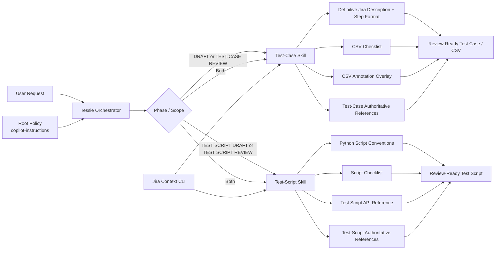

# MFD Copilot Harness Context Repository

## Why This Repository Exists
This repository stores the context-engineering configuration for MFD verification work.

The current setup is intentionally phase-split, authority-driven, and easier to maintain:
- Test-case phases are handled by one focused skill.
- Test-script phases are handled by another focused skill.
- Tessie orchestrates and delegates.
- Root instructions define always-on policy.
- Authoritative reference files hold decision authority and a growing list of script exemplars.

## Current Harness Configuration

| Layer | File | Responsibility |
| --- | --- | --- |
| Root policy | [.github/copilot-instructions.md](.github/copilot-instructions.md) | Always-on mission, workflow phases, source precedence, safety, and key reference map. |
| Orchestration | [.github/agents/MFD Test Script Agent.agent.md](.github/agents/MFD%20Test%20Script%20Agent.agent.md) | Tessie routes `csv`, `script`, or `both` and delegates to phase skills. |
| Live Jira context | [.github/skills/jira-context-cli/SKILL.md](.github/skills/jira-context-cli/SKILL.md) | Pulls current Jira/TestRay issue data first for named keys. |
| Test-case phase skill | [.github/skills/mfd-test-case-validation/SKILL.md](.github/skills/mfd-test-case-validation/SKILL.md) | DRAFT and TEST CASE REVIEW workflow, definitive Jira description/step format, CSV checklist usage. |
| Test-script phase skill | [.github/skills/mfd-test-script-validation/SKILL.md](.github/skills/mfd-test-script-validation/SKILL.md) | TEST SCRIPT DRAFT and TEST SCRIPT REVIEW workflow, script implementation and review gates. |
| Test-case authority map | [.github/skills/mfd-test-case-validation/references/authoritative-references.md](.github/skills/mfd-test-case-validation/references/authoritative-references.md) | Decision authority for test-case work plus living script-reference notes. |
| Test-script authority map | [.github/skills/mfd-test-script-validation/references/authoritative-references.md](.github/skills/mfd-test-script-validation/references/authoritative-references.md) | Decision authority for script work plus living script-reference notes. |
| CSV annotation overlay | [.github/instructions/mfd-test-step-annotation-overlay.instructions.md](.github/instructions/mfd-test-step-annotation-overlay.instructions.md) | Default step-label overlay for Jira test-step CSV readability. |
| Script coding conventions | [.github/instructions/mfd-delta-test-scripts-python.instructions.md](.github/instructions/mfd-delta-test-scripts-python.instructions.md) | Python conventions for delta-test-scripts authoring. |
| Placement policy | [.github/context-placement.md](.github/context-placement.md) | Where policy belongs across root, agent, skills, and instructions. |

## Architecture Diagram

## End-To-End Workflow Supported
1. Test-case DRAFT and requirement linking.
2. Test-step authoring/revision in Jira-ready CSV format.
3. TEST CASE REVIEW hardening and resubmission.
4. TEST SCRIPT DRAFT from reviewed step intent.
5. TEST SCRIPT REVIEW hardening and merge readiness.

## Why This Configuration Is Valuable
- Reduces context sprawl by splitting responsibilities by phase.
- Keeps CSV structure standards in one definitive place for test-case work.
- Keeps script conventions in a dedicated instruction for script work.
- Front-loads live Jira context for current issue truth.
- Uses explicit authority mapping to reduce style and evidence conflicts.
- Makes future tuning cheap: update one layer without rewriting everything.

## Authoritative References As A Living Standard
Both authority files are now designed to grow over time:
- [.github/skills/mfd-test-case-validation/references/authoritative-references.md](.github/skills/mfd-test-case-validation/references/authoritative-references.md)
- [.github/skills/mfd-test-script-validation/references/authoritative-references.md](.github/skills/mfd-test-script-validation/references/authoritative-references.md)

They include maintainer notes to append script exemplars plus short statements of what each script does well. This creates a practical, evolving reference set instead of static one-off examples.

## Why Tessie Functions As An Orchestrator
Tessie intentionally stays thin and does not own deep validation policy.

Tessie adds value by:
- Classifying incoming work as `csv`, `script`, or `both`.
- Enforcing phase routing to the right skill.
- Ensuring live Jira context is pulled early for named keys.
- Delegating detailed rules to skills and instructions instead of duplicating them.

This keeps orchestration stable while phase logic and formatting logic evolve independently.

## What Was Wrong With Old Tessie, And How This Repo Was Transformed

Previous pain points:
- One broad validation surface with cross-references that were hard to follow.
- More redundant policy spread across agent, skill, and references.
- Higher risk of policy drift when changing CSV or script rules.
- Heavier dependence on implicit memory versus explicit phase ownership.

Current transformation:
- Split workflow into two focused skills:
  - Test-case phase: [.github/skills/mfd-test-case-validation/SKILL.md](.github/skills/mfd-test-case-validation/SKILL.md)
  - Test-script phase: [.github/skills/mfd-test-script-validation/SKILL.md](.github/skills/mfd-test-script-validation/SKILL.md)
- Removed legacy pointer layers and source-truth-map files.
- Kept authority maps as explicit tie-break and exemplar-growth surfaces.
- Moved to a cleaner harness where root policy is stable, Tessie orchestrates, and phase skills carry execution detail.

Net result: cleaner context, clearer ownership, faster updates, and more consistent review-ready outputs.
