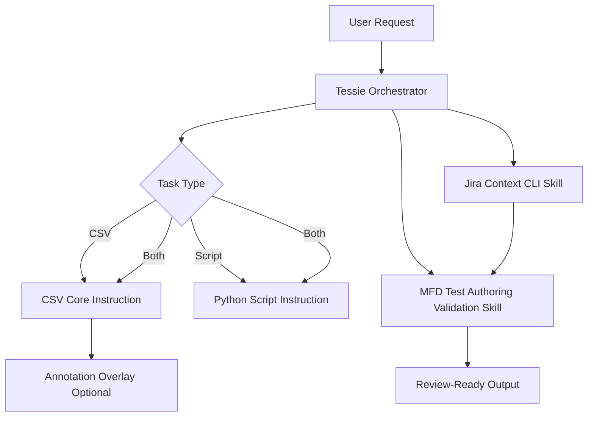

# MFD Copilot Harness Context Repository

## Why This Repository Exists
This repository stores the context-engineering assets that shape how the harness assists MFD verification work.

Before this setup, key guidance lived in fewer places and was harder to enforce consistently across Jira test-step authoring and script authoring.

This repository makes that guidance explicit, layered, and reusable.

## Zoomed-Out View: Key Relationships
This repository uses a layered context model where each layer has a narrow, explicit responsibility.

- Foundational context defines project mission, Jira phase workflow, evidence precedence, and safety boundaries.
- Tessie routes work and delegates instead of acting as one large rule bundle.
- The Jira Context CLI skill provides live Jira/TestRay truth for named issues.
- The MFD test authoring validation skill runs artifact-specific workflows and checklist contracts.
- Core instructions enforce file-type standards for CSV artifacts and Python scripts.
- The annotation overlay instruction adds optional Step label style after core CSV rules.
- Supporting docs provide examples and references without changing core policy.

In short, the relationship is: orchestrate first, fetch live evidence early, enforce standards by file type, then apply optional style overlays.

## Jira Workflow Supported By This Context
1. Test case draft and requirement linking.
2. Test steps draft in chat.
3. CSV artifact generation for Jira import.
4. Test case review.
5. Test script draft.
6. Test script review and merge.

## Context Map: File Responsibility And Value

| File | Responsibility | Value To Leads And Authors |
| --- | --- | --- |
| [.github/copilot-instructions.md](.github/copilot-instructions.md) | Foundational, always-on project rules, workflow phases, evidence priority, safety rails. | Gives a single source for mission, boundaries, and workflow sequencing. |
| [.github/agents/MFD Test Script Agent.agent.md](.github/agents/MFD%20Test%20Script%20Agent.agent.md) | Tessie orchestrator behavior and delegation model. | Keeps orchestration light and predictable while pushing detailed rules into maintainable layers. |
| [.github/skills/jira-context-cli/SKILL.md](.github/skills/jira-context-cli/SKILL.md) | CLI-first live Jira/TestRay retrieval workflow. | Reduces stale-context mistakes by prioritizing live issue data over old CSV snapshots. |
| [.github/skills/jira-context-cli/references/commands.md](.github/skills/jira-context-cli/references/commands.md) | Day-to-day command patterns for issue/section fetches. | Speeds up reliable context retrieval and reduces command drift. |
| [.github/skills/jira-context-cli/references/debugging.md](.github/skills/jira-context-cli/references/debugging.md) | Troubleshooting for CLI failures and schema drift. | Lowers downtime when Jira data access or field mapping changes. |
| [.github/skills/mfd-test-authoring-validation/SKILL.md](.github/skills/mfd-test-authoring-validation/SKILL.md) | End-to-end CSV/script validation workflow with separate checklist paths. | Prevents cross-applying wrong standards and keeps outputs phase-correct. |
| [.github/skills/mfd-test-authoring-validation/references/csv-checklist.md](.github/skills/mfd-test-authoring-validation/references/csv-checklist.md) | Test-step quality and coverage checklist. | Improves requirement coverage and review confidence. |
| [.github/skills/mfd-test-authoring-validation/references/csv-import-style.md](.github/skills/mfd-test-authoring-validation/references/csv-import-style.md) | CSV import shape gate (header, columns, expected-result format). | Prevents Jira import/formatting churn and column-layout regressions. |
| [.github/skills/mfd-test-authoring-validation/references/missing-jira-test-case-format.md](.github/skills/mfd-test-authoring-validation/references/missing-jira-test-case-format.md) | Fallback template when Jira test-case description or steps are missing. | Provides deterministic recovery path instead of ad hoc rewrites. |
| [.github/skills/mfd-test-authoring-validation/references/script-checklist.md](.github/skills/mfd-test-authoring-validation/references/script-checklist.md) | Script-focused review checklist. | Increases script review quality and traceability to step intent. |
| [.github/skills/mfd-test-authoring-validation/references/evidence-map.md](.github/skills/mfd-test-authoring-validation/references/evidence-map.md) | Where to find source-truth evidence in MFD and test-framework repos. | Shortens investigation time and improves consistency of technical grounding. |
| [.github/instructions/mfd-jira-test-steps-csv.instructions.md](.github/instructions/mfd-jira-test-steps-csv.instructions.md) | Core mandatory rules for Jira-import CSV test-step artifacts. | Ensures consistent CSV structure and expected-result conventions. |
| [.github/instructions/mfd-test-step-annotation-overlay.instructions.md](.github/instructions/mfd-test-step-annotation-overlay.instructions.md) | Optional, hot-swappable post-core annotation preferences for Step labels. | Lets teams personalize readability style without breaking core import standards. |
| [.github/instructions/mfd-delta-test-scripts-python.instructions.md](.github/instructions/mfd-delta-test-scripts-python.instructions.md) | Python script conventions in delta-test-scripts. | Improves script consistency, step traceability, and safe data-dictionary usage. |
| [.github/agents/MFD Agent Supporting Docs](.github/agents/MFD%20Agent%20Supporting%20Docs) | Supporting references and examples. | Provides reusable examples and context aids without crowding foundational files. |

## Layering Model (How The Pieces Work Together)
1. Foundational intent and workflow come from copilot-instructions.
2. Tessie orchestrates and delegates.
3. Skills provide procedural workflows.
4. Instruction files enforce file-type rules.
5. Overlay instruction adds optional style after core standards.

## Why This Helps Churn Rate
Context engineering lowers churn by reducing preventable rework loops.

Main churn drivers addressed:
- Stale Jira context.
- CSV formatting mismatches during Jira import.
- Missing or weak requirement-to-step traceability.
- Mixing CSV and script validation criteria.
- Inconsistent step annotation style expectations.

Expected impact:
- Fewer test cases bounced in TEST CASE REVIEW.
- Fewer script revisions in TEST SCRIPT REVIEW.
- Fewer CSV re-export/re-import correction cycles.
- Faster onboarding and more consistent author output.

## Suggested Metrics To Track Churn Improvement
1. Average TEST CASE REVIEW return count per test case.
2. Average TEST SCRIPT REVIEW return count per script.
3. Percentage of CSV imports that pass formatting expectations on first import.
4. Percentage of artifacts accepted on first review pass.
5. Time from draft start to review-ready submission.

## What Was Repurposed: Tessie As A Thin Orchestrator
Tessie is intentionally not a giant rules file anymore.

Tessie now acts as a thin orchestrator:
- It classifies the task as csv, script, or both.
- It gathers evidence in the right order.
- It delegates detailed standards and validation logic to scoped instructions and skills.

### Plain-English Value Add
Without Tessie as an orchestrator:
- Engineers must remember where to look first and which checklist/rules to apply.
- Jira context fetch, CSV formatting rules, and script rules can be applied inconsistently.
- Review feedback often repeats (missing links, formatting drift, unclear expected results).

With Tessie as an orchestrator:
- The harness routes the request through a consistent workflow.
- Jira context is fetched first when issue keys are in scope.
- CSV and script validations are applied in the correct phase and order.
- Outputs are more review-ready on first pass.

## Scope Notes
This repository is for MFD harness context artifacts.

Current project intent is to use the MFD Test Script Agent workflow (Tessie orchestration) and the associated MFD-focused skills and instructions.
